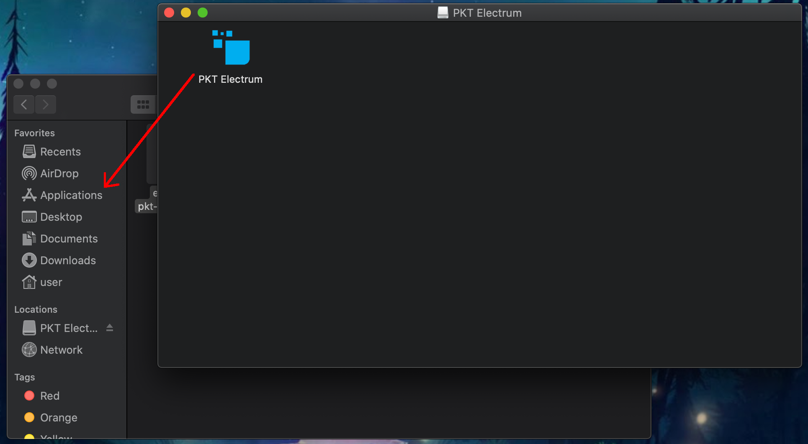
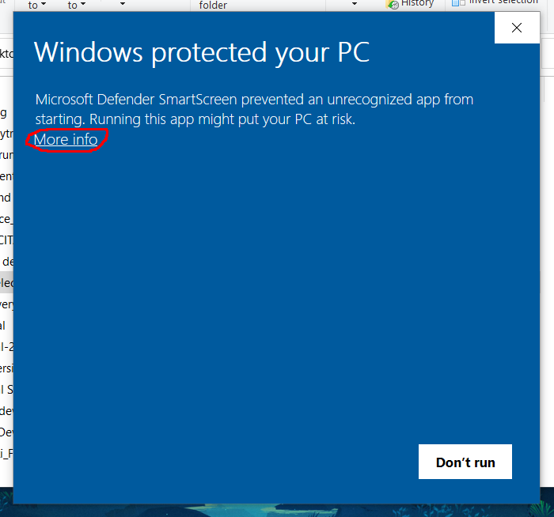
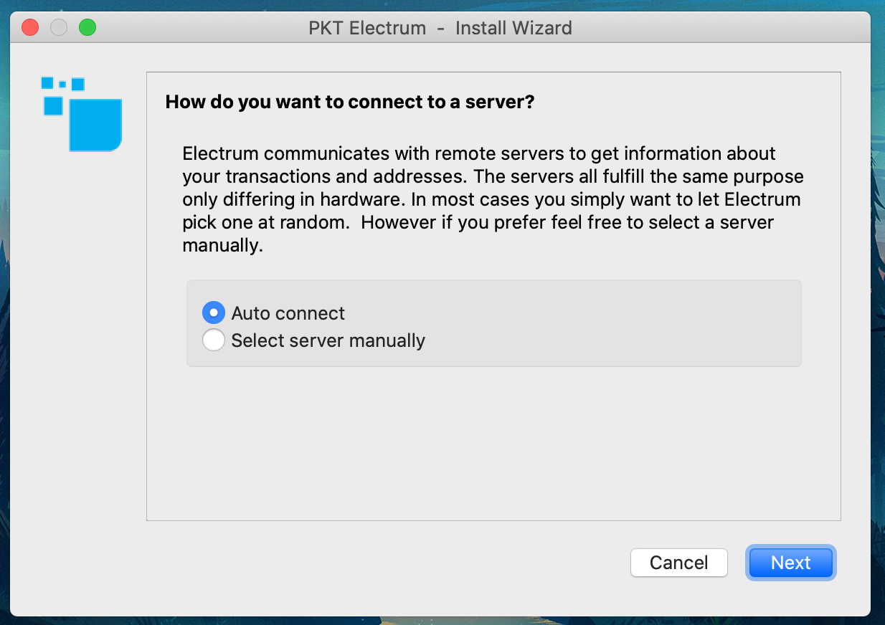
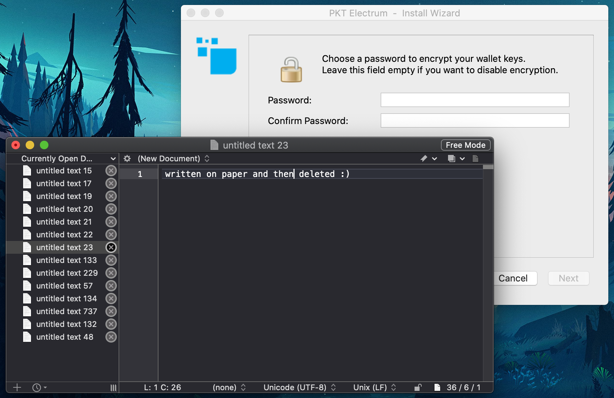
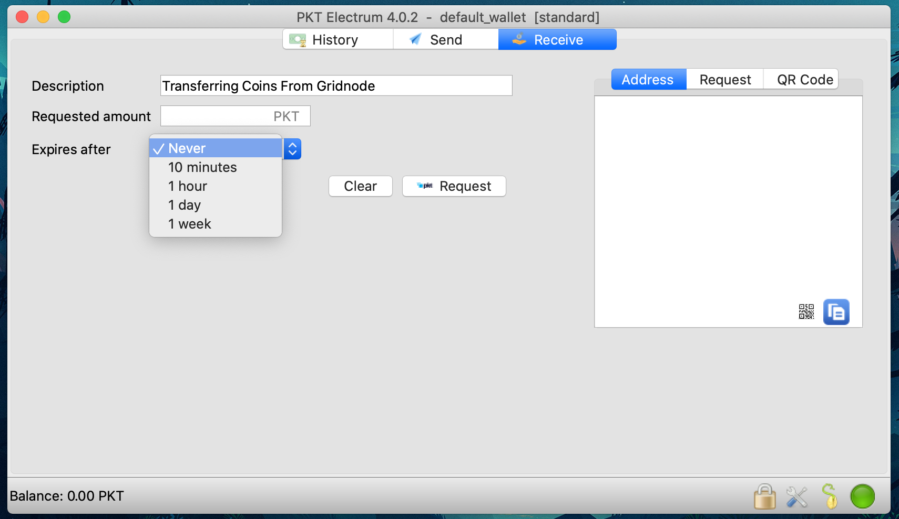
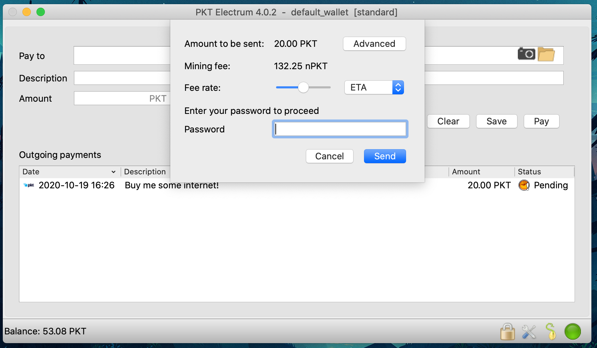

# PKT electrum

## First setup
### MacOS
1. Download [electrum-pkt-4.0.7-1-big-sur.dmg](https://drive.google.com/file/d/1o7qRDAu9w9zBMypey6YczMRDh61U83Kp/view?usp=sharing)
  * If you are using an older version of OSX then you might need to use [electrum-pkt-4.0.2.dmg](https://drive.google.com/file/d/1YK1_1EFqb60ocnSIxmjdbPpHvGDi2_FB/view?usp=sharing) instead.
2. Open Finder
3. Double-click on your Downloads folder and find and click on `electrum-pkt-4.0.2.dmg`
  * 
4. A new window will open with the PKT Electrum app, click and drag it into your Applications folder
  * 
5. Press Command+Space to open your Spotlight Search and type PKT Electrum, when you see the PKT Electrum app, press the Enter key to open it.
  * 
6. The first time PKT Electrum is opened, you will get a popup asking you if you want to open it, click **open**
  * 
6. Continue with **Setting up your wallet** below

### Windows
1. Download [pkt-electrum.exe](https://drive.google.com/file/d/1ohm3Epy7pTItXirO0mVCZT5vyhWat5dc/view?usp=sharing) file
2. You will see a popup window telling you the application is not signed by a Microsoft Authorized Developer, always be sure you download PKT Electrum from the original website, do not run any app given to you in a chat, file-sharing or email attachment. Click "More info" to show additional options.

3. Click the "Run anyway" button to launch PKT Electrum, you won't see this message again.

4. Continue with **Setting up your wallet** below

### Linux
1. Download [pkt-electrum.x86_64.AppImage](https://drive.google.com/file/d/142ouwnph8eD_yniOBvrsXW7fvVzFF9O8/view?usp=sharing)
2. Click on the downloaded file and PKT Electrum should start up right away.

## Setting up your wallet
Before you can begin using PKT, you need to setup your wallet, this means writing down your secret key and setting passwords so your PKT will stay safe.

1. First you will be asked if you want to configure the server to connect to, unless you are an advanced user, just click "next"

2. Next select your wallet, you give your wallet a name if you wish, or leave it as `default_wallet`, then click "next".

3. You will be prompted to select which type of wallet you are creating, unless you are doing something fancy, you'll want to just click "next"

4. Next you will have the option to create a wallet using a secret key from different sources, for the purposes of this tutorial just click next.

5. Next you will be asked if you want to create a "legacy" style wallet, this is not needed so just click "next"

6. Now PKT Electrum is going to create a *seed*, it takes the form of 12 words and from it your entire wallet is created
  * If you have these 12 special words, you can recover your PKT even if your computer is lost or damaged
  * If someone else gets access to these 12 words, *they can steal all of your PKT*
  * It is recommended that you write this on paper and keep in a safe place.

7. After you have written your seed, you will be asked to type it back in, the fast way to do this is by copy/paste to a text pad

8. Now you'll be asked to write it back in, you can copy it from the text pad

9. Make sure you really stored your seed on paper, we do not recommend storing it on *any electronic device*.

10. Now you will need to pick a passphrase for your wallet
  * This passphrase encrypts your wallet, protecting your PKT even if your computer is stolen
  * Unlike your seed, the passphrase is useless without the wallet file
  * We recommend using https://www.useapassphrase.com/ to pick a strong passphrase for you
  * You can store your passphrase on your phone to have easy access

11. Congratulations, you now have a PKT wallet!
  * It will require about 5 minutes to synchronize with the PKT blockchain, but you can still use it while this is happening.

## Receiving PKT
1. To receive coins, you need to create a new PKT *address*
  * Click the "Receive" tab
  * Type a description for the purpose of receiving the coins, this will appear in the notification when you get paid
  * Set the expiration, if this is not an *invoice*, you can choose "never"

2. After you click "Request", your wallet will create a new address and copy it to your clipboard so you can send it to the person paying you (or transfer money to your new wallet)

3. When PKT gets sent to your new address, you will get a notification. It says "unconfirmed" because the transaction has not yet been included in the history of the blockchain.

4. Once your transaction has been included in the blockchain, this icon will change to a clock and then after a few minutes, a checkmark

5. Congratulations, you have received your first PKT

## Sending PKT
1. To pay PKT to someone else, click on the Send tab and paste the address to be paid
  * Type a description of the payment, this is just for you, it will not be sent to the person you are paying
  * Enter the amount to be paid
  * Click Pay

2. You will be prompted to enter your *wallet passphrase* in order to decrypt the wallet for one brief moment to send the PKT
  * Every transaction requires a *fee* for inclusion in the blockchain, this is a *very* small cost: 132 nPKT is one hundred and thirty two *nano-PKT* (that means **billionths**, i.e. 0.000000132 PKT)

3. After you enter your passphrase and click "send", you will see a *transaction ID*, this set of numbers and letters uniquely identifies your transaction and can be used to view it in the block explorer.

4. Just like when receiving, your transaction will appear first as "unconfirmed" and then later it will switch to a clock when it has been included in the blockchain.

5. After waiting a few minutes, you will see a clock and then later a checkmark indicating your transaction has been included in the blockchain

6. When people consider a transaction to be "complete" depends on the merchant, but in general it should be considered to be ok once it switches from "unconfirmed" to the clock icon. Congratulations, you've sent PKT!

## About Units
* Each PKT is made up of 1000 milli-PKT, denoted `mPKT`
* Each milli-PKT is sub-divided into 1000 micro-PKT, denoted `uPKT`
* Each micro-PKT is sub-divided into 1000 nano-PKT, denoted `nPKT`

## Advanced usage
### Recover from seed
You can recover a PKT Electrum wallet from the seed you were given when you set it up. To do this follow the same instructions as for any other Electrum wallet: https://bitcoinelectrum.com/restoring-your-standard-wallet-from-seed/

Note that recovery from seed will **not** work to import addresses from other wallets such as a Gridnode.

### Multi-signature
Setting up multi-signature in PKT Electrum is the same as with Bitcoin Electrum so you can follow this tutorial: https://electrum.readthedocs.io/en/latest/multisig.html

## How it works
PKT Electrum is signnificantly similar to Bitcoin Electrum. It contacts one of a pool of community operated [electrumx](https://electrumx.readthedocs.io/en/latest/protocol.html) servers. Instead of syncing the entire chain it requests information about its addresses from the electrumx server and only downloads enough of the blockchain to verify that the electrumx server is not trying to trick it.

In practice this means the wallet needs to check the proof of work and sync the block *headers* but not the rest of the blocks. Since PKT uses [PacketCrypt](https://github.com/cjdelisle/PacketCrypt) proof of work, the work verification needs to be different. PacketCrypt headers are fairly large, between 4KB and 16KB, even at only 4KB each they make up 2.1GB of data per year. To maintain security without downloading an unacceptably large amount of data, PKT Electrum downloads only a small number of PacketCrypt proofs near the tip of the chain.

If the wallet only downloaded (say) the most recent 100 PacketCrypt proofs, an attacking electrumx server would know exactly how many blocks it needed to *mine* in order to create a convincing fake chain, PKT Electrum makes this more difficult by using statistical verification.

### Statistical Verification
PKT Electrum makes the job of an attacker hard by asking for an unpredictable random set of PacketCrypt proofs, the chance of any give block being verified is based on the distance between the tip of the chain and that block. The chance is defined as `MIN(100%, K / distance_from_tip)` where `K` is a constant which we set at `20` to make PKT Electrum verify around 200 blocks total.

With `K = 20`, the first 20 blocks have a 100% chance of being verified.
* block 21 has a 95% chance
* block 25 has an 80% chance
* block 50 has a 40% chance
* block 80 has a 25% chance

The distribution of likelyhood of verifying a block is shown by this chart:

## Running an ElectrumX server
If you would like to participate in running your own ElectrumX server to help the PKT Electrum network, you can do so using a simple Docker command.

Check out the [Docker PKT Electrumx](https://github.com/cjdelisle/pkt-docker-electrumx/blob/master/README.md) project for more information about how to run an instance.

