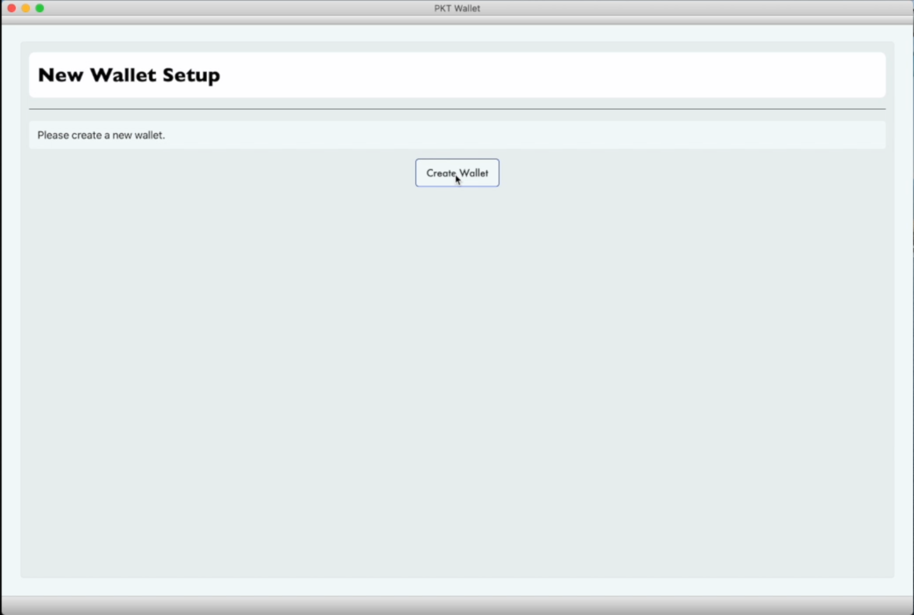
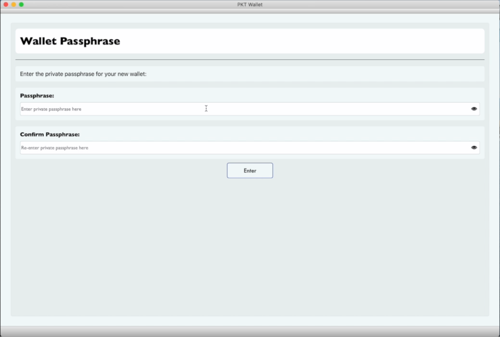
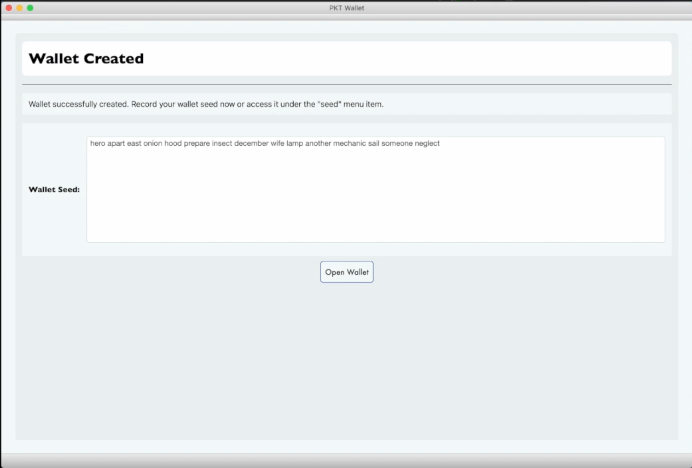
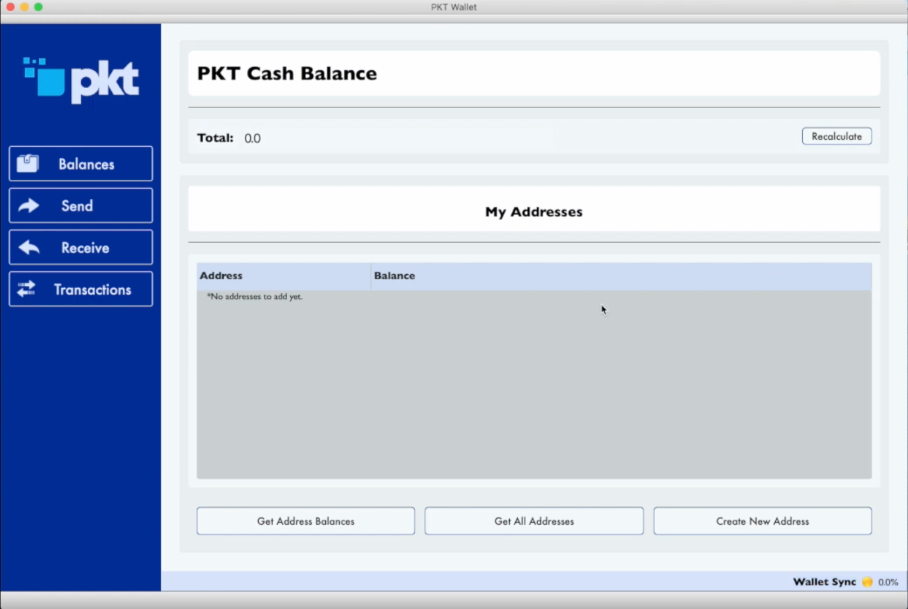
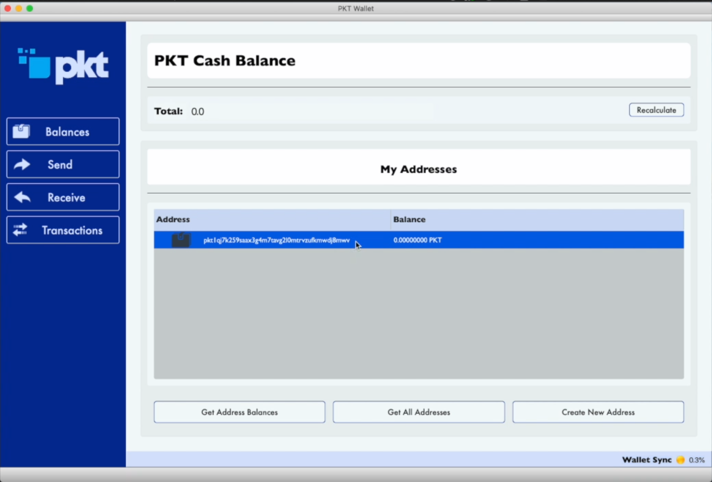
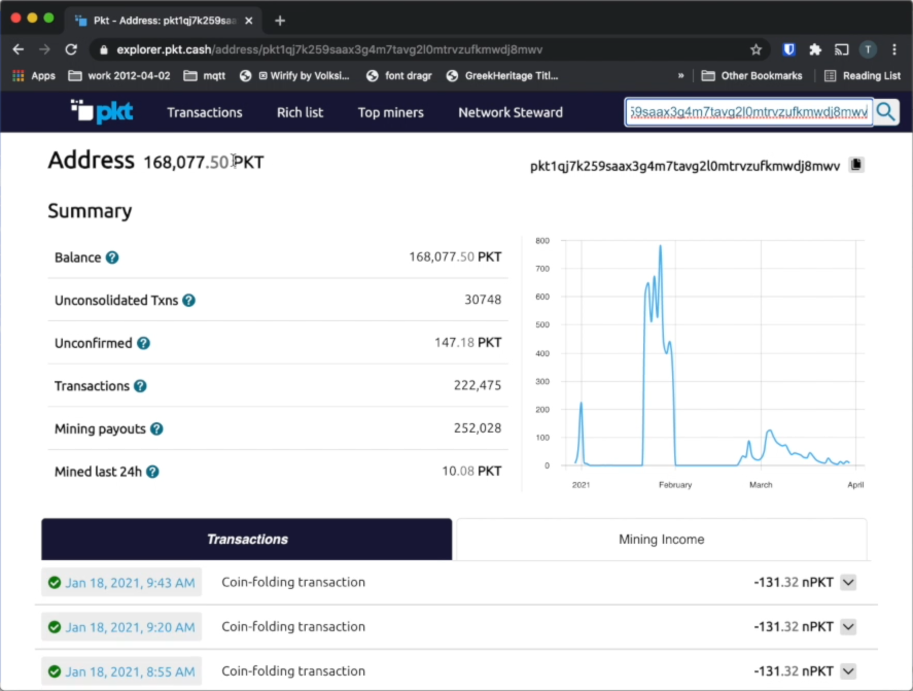
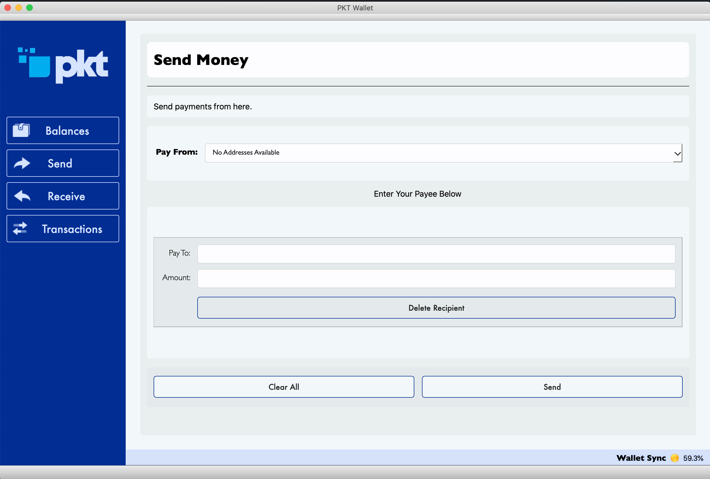

# PKT Wallet MacOS GUI

**NOTE**: The PKT Wallet GUI handles mining income well and is a good wallet for those hoping to hold a copy of the blockchain and to keep ownership of their own keys and passphrases for multiple addresses.

## First setup
### MacOS
1. Download [pktwallet-(version).dmg
](https://github.com/artrepreneur/Vodun/releases)
2. Open Finder
3. Double-click on your Downloads folder and find and double-click on `pktwallet-(version).dmg` to open the disk image
  * 
4. A new window will open with the PKT Wallet app, click and drag it into your Applications folder
  * 
5. Press Command+Space to open your Spotlight Search and type PKT Wallet, when you see the PKT Wallet app, press the Enter key to open it.
  * 
6. The first time PKT Wallet is opened, you will get a popup asking you if you want to open it, click **open**
  * 
6. Continue with **[Setting up your wallet](#setting-up-your-wallet)** or **[Load Existing Wallet From Seed](load-existing-wallet-from-seed)** below.

## Setting up your wallet
Before you can begin using PKT, you need to setup your wallet, this means writing down your secret key and setting passwords so your PKT will stay safe.

1. You will be asked to create a new wallet. Click "Create Wallet"

2. Enter passphrase to encrypt your wallet. This passphrase must have upper case and lower case letters and numbers. Retype the passphrase to match and click the "Enter" button

3. You will be asked if you want to import an existing seed. Click the "Continue Without Seed" button to continue.

4. A 15-word wallet seed will be created for you. Write this seed down. It enables you to open your PKT wallet on another computer or smartphone, for example if your current computer dies. It is advisable to write this on a piece of paper and store it in a safe place. Click "Open Wallet" to continue.

5. You will be brought to the main "Balances" screen. By default you have no addresses, so you will need to create one.

6. Click the "Create Address" button, and then click the "Generate" button to generate a new address. The resulting code is the public address which people can pay you at.

7. Click "Balances" again to display your balances. By default, accounts with zero PKT will not be displayed unless you click "Get All Addresses"

## Load Existing Wallet From Seed
Before you can begin using PKT, you need to setup your wallet, this means writing down your secret key and setting passwords so your PKT will stay safe.

1. You will be asked to create a new wallet. Click "Create Wallet"

2. Enter passphrase to encrypt your wallet. This passphrase must have upper case and lower case letters and numbers. Retype the passphrase to match and click the "Enter" button

3. You will be asked if you want to import an existing seed. Type in your wallet seed and **any** passphrase. Click the "Continue With Seed" button to continue.

4. Your 15-word wallet seed will be displayed on the next screen. Write this seed down. It enables you to open your PKT wallet on another computer or smartphone, for example if your current computer dies. It is advisable to write this on a piece of paper and store it in a safe place. If you have a legacy wallet (from versions prior to 1.0.0), you will never be able to retrieve this seed again from the app. Click "Open Wallet" to continue.

5. You will be brought to the main "Balances" screen. By default you have no addresses, so you will need to create one.

6. Click the "Create Address" button, and then click the "Generate" button to generate a new address. The resulting code is the public address which people can pay you at. If this wallet previously had a wallet, address is actually an exsting one that has been retrieved, rather than a newly created address.

7. Click "Balances" again to display your balances. By default, accounts with zero PKT will not be displayed unless you click "Get All Addresses".

8. It may take several hours for the app to sync the blockchain for the first time. During that time, balances will not be available for your addresses. You will have to verify the balance on the address using the [PKT Blockchain Explorer](https://explorer.pkt.cash/)
  * Click "Receive" and select the wallet you want to inspect

  * Copy and paste the address into the search field of the PKT Blockchain Explorer, then click the "Search" icon.

## Receiving PKT
1. To receive coins, you need to create a new PKT *address*
  * Click the "Receive" tab
  * Type a description for the purpose of receiving the coins, this will appear in the notification when you get paid
  * Set the expiration, if this is not an *invoice*, you can choose "never"

2. After you click "Request", your wallet will create a new address and copy it to your clipboard so you can send it to the person paying you (or transfer money to your new wallet)
3. When PKT gets sent to your new address, you will get a notification. It says "unconfirmed" because the transaction has not yet been included in the history of the blockchain.
4. Congratulations, you have received your first PKT. It make take some time before the transaction is confirmed by the network and the PKT is formally in your account.

## Sending PKT
1. To pay PKT to someone else, click on the Send tab and paste the address to be paid
  * Type a description of the payment, this is just for you, it will not be sent to the person you are paying
  * Enter the amount to be paid
  * Click Pay

2. You will be prompted to enter your *wallet passphrase* in order to decrypt the wallet for one brief moment to send the PKT
  * Every transaction requires a *fee* for inclusion in the blockchain, this is a *very* small cost: 132 nPKT is one hundred and thirty two *nano-PKT* (that means **billionths**, i.e. 0.000000132 PKT)
3. After you enter your passphrase and click "send", you will see a *transaction ID*, this set of numbers and letters uniquely identifies your transaction and can be used to view it in the block explorer.
4. Just like when receiving, your transaction will appear first as "unconfirmed" and then later it will switch to a clock when it has been included in the blockchain.
5. When people consider a transaction to be "complete" depends on the merchant, but in after some time the transaction will be confirmed and the PKT be in the recipient's account. Congratulations, you've sent PKT!

## About Units
* Each PKT is made up of 1000 milli-PKT, denoted `mPKT`
* Each milli-PKT is sub-divided into 1000 micro-PKT, denoted `uPKT`
* Each micro-PKT is sub-divided into 1000 nano-PKT, denoted `nPKT`

### Statistical Verification
PKT Electrum makes the job of an attacker hard by asking for an unpredictable random set of PacketCrypt proofs, the chance of any give block being verified is based on the distance between the tip of the chain and that block. The chance is defined as `MIN(100%, K / distance_from_tip)` where `K` is a constant which we set at `20` to make PKT Electrum verify around 200 blocks total.

With `K = 20`, the first 20 blocks have a 100% chance of being verified.
* block 21 has a 95% chance
* block 25 has an 80% chance
* block 50 has a 40% chance
* block 80 has a 25% chance

The distribution of likelyhood of verifying a block is shown by this chart:

