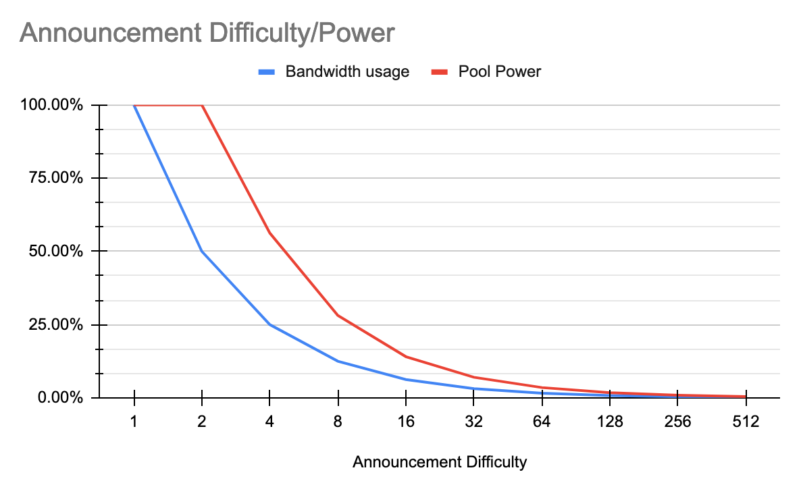

# How to Start Announcement Mining
Announcement Mining creates a small (1KB) message that is difficult to compress and proves work was done. Announcements are transmitted to and collected by block miners to form blocks. This simulates the transmission of data across the network. Announcement miners must maximize their CPU processing power and bandwidth upload speed for the highest yields. Announcement mining can be done from nearly any device that has a CPU processor and access to bandwidth.

Also include: Multi-pool mining means submitting the exact same announcements to multiple pools. So if you have the bandwidth available it will always benefit you to mine in all of the major pools.

## Mining

PacketCrypt is a _bandwidth hard proof of work_, this means it requires lots of bandwidth to mine.
Miners collaborate with one another by sending small messages (called _Announcements_) and the
sending of these messages requires a large amount of _bandwidth_.

Miners who are working in collaboration with one another are members of a mining pool, therefore
all mining of PacketCrypt is done in pools.

PacketCrypt mining is split into two distinct stages:

- Announcement Mining - Using your CPU to create Announcements
- Block Mining - Collecting Announcements from Announcement Miners and using them to mine blocks

Block mining is typically done at the mining pool's datacenter, however Announcement mining can be
done from anywhere.

---

## How to Announcement mine

There are a number of options available when it comes to installing the PacketCrpyt announcement miner. Choose whichever best suits your technical ability:

### 1. Install a Pre-built Binary

Pre-built packetcrypt binaries (for linux) or installation packages (for macos) and archives (for windows) can be downloaded from [packetcrypt releases page](https://github.com/cjdelisle/packetcrypt_rs/releases/).

- For **windows**, download the zip archive suffixed with `-windows.zip`  
  and extract its content.
- For **macos**, download the package suffixed with `.pkg`  
  and click on its icon in the Finder for installation.
- For **linux**, download the binary suffixed with `-linux_amd64`
  and rename it `packetcrypt`.
- - If you're on Arch linux or Manjaro, you can install the [packetcrypt AUR package](https://aur.archlinux.org/packages/packetcrypt)


### 2. Deploy a Docker Image

There is a PacketCrypt Docker image available, which can be used for announcement mining.

To install:

1. Download and install [Docker](https://www.docker.com/) for your operating system.

2. Download the PacketCrypt Docker image:

```console
$ docker pull thomasjp0x42/packetcrypt
```

There are also PacketCrypt Docker images built without the portable flag (`--no-portable`) which may increase the performance of the announcement mining while reducing CPU compatibility. One such image (compiled on AMD 5950x) is available at `thomasjp0x42/packetcrypt-amd64`. Additionally, for ARM devices such as Raspberry Pi, there is an image available at `thomasjp0x42/packetcrypt-arm64`. The arm64 image will also work on Apple silicon such as the M1 and M2 chips.

3. Run the container similar to the commands described in the [Begin Announcement Mining](#begin-announcement-mining) section, except replace this part of the command:

```console
$ packetcrypt
```

with this command to run PacketCrypt from Docker:

```command
$ docker run thomasjp0x42/packetcrypt
```

The final command will be formatted like this:

```console
$ docker run thomasjp0x42/packetcrypt ann -p <your_wallet_address> <pool_1>
```

More information can be found at the [PacketCrypt DockerHub page](https://hub.docker.com/r/thomasjp0x42/packetcrypt)

### 3. Build From Source

Building from source will generally offer the best mining performance but requires more technical knowledge than the previous two options.

First install rust if you haven't, see: [rustup](https://rustup.rs/)

```
git clone https://github.com/cjdelisle/packetcrypt_rs
cd packetcrypt_rs
cargo build --release
```

See the [PacketCrypt GitHub repository](https://github.com/cjdelisle/packetcrypt_rs) for more detailed instructions.

---

### Begin Announcement Mining

!!! danger "Important"
    **You cannot mine into the electrum wallet**, You can only mine into the [Command Line Wallet](https://docs.pkt.cash/en/latest/pktd/pktwallet/), the [Pkt.World Wallet](https://www.pkt.world/wallet) or the [Mac GUI Wallet](https://github.com/artrepreneur/PKT-Cash-Wallet/releases) .

To begin mining, you will need the address of your wallet and you will need to choose a pool.

There are two ways to configure the announcement miner; by using CLI parameters or by using a configuration file:

**Using the CLI**

    packetcrypt ann -p <your_wallet_address> pool_1 [pool_2 pool_3 pool_4]

    [or for windows]

    packetcrypt.exe ann -p <your_wallet_address> pool_1 [pool_2 pool_3 pool_4]

**Using a Configuration File**

A configuration file must be in JSON format. The file can be loaded from the local filesystem or from a web-accessible location.

Any CLI parameters used will overide the corresponding settings in the configuration file.

Example config.json:

```
{
  "payment_addr": "<your_wallet_address>",
  "pools": [
    "pool_1",
    "pool_2",
    "pool_3",
    "pool_4"
  ]
}
```
    packetcrypt ann -c "./config.json"

    [or]

    packetcrypt ann -c "https://example.com/config.json"

    [or for windows]

    packetcrypt.exe ann -c "./config.json"

    [or]

    packetcrypt.exe ann -c "https://example.com/config.json"

Announcement mining can be done into a single pool or multiple pools. When you announcement mine into multiple pools, you will be paid by each pool that you submit announcements to.

pool_1 is the pool running the highest difficulty. If you notice problems, you can test listing the pools in a different order. The number of pools you mine into is at your discretion. If a pool is down or malfunctioning you will notice the pool is not mining at [100%] in your mining feed and you can choose to remove the under-performing or malfunctioning pool.

## How to install a PKT miner on Mac

1. Install the [Zulu](https://github.com/artrepreneur/Zulu){target=_blank} or [CLI](https://docs.pkt.cash/en/latest/pktd/pktwallet/) PKT Wallet from [https://docs.pkt.cash](https://docs.pkt.cash)
2. Download the [PacketCrypt.pkg](https://github.com/cjdelisle/packetcrypt_rs/releases/tag/packetcrypt-v0.5.0){target=_blank} for mac
3. Open your Terminal
4. Install Rust by entering in the command: ```$ curl --proto '=https' --tlsv1.2 -sSf * https://sh.rustup.rs | sh```
5. Press **1** to confirm
6. Enter the command: ```$ sudo install make```
7. Enter the command: ```$ git clone https://github.com/cjdelisle/packetcrypt_rs```
8. Enter the command: ```$ cd packetcrypt_rs```
9. Enter the command: ```$ ~/.cargo/bin/cargo build --release```
10. Enter the command: ```$ ./target/release/packetcrypt ann -p [your PKT Wallet Address] [pool 1] [pool 2] [pool 3] [pool 4] ```

## Choosing Pools to mine in

You can mine in as many pools as you have the bandwidth to supply. The same data will be uploaded so your CPU is only used once. Currently the pools which are regularly winning blocks include:

- Pkteer: `http://pool.pkteer.com`
- PKTPool: `http://pool.pktpool.io`
- PktWorld: `http://pool.pkt.world`
- Zetahash (f.k.a. Srizbi): `https://stratum.zetahash.com`

In general the recommendation is to list the pool with highest difficulty in the first position to ensure your announcements will be accepted, as the standardized policy is to accept announcements of a higher difficulty for pools with a lower base difficulty. In some cases the rewards might vary depending on the pool order regardless of difficulty, subject to custom policies implemented by the respective pools.

(Check the relevant channels on Discord for current pool statuses)

You should test your daily earnings on each pool to see which one is best. Your mining revenue depends on how much each pool allocates towards announcement miners as well as how much hardware they are using in-house. The pools are winning different blocks and if you mine to just one pool, your not getting any payment from the others when they win a block. It's the same with mining to a pool that is not winning any blocks.

---

## Limiting System Resource Usage

Limiting the system resources available to Packetcrypt may negatively effect your mining power but can be useful to conserve resources for other processess.

#### Limit CPU Usage

Announcement mining is a resource intensive process. By default, Packetcrypt will use 100% of the available CPU resources. CPU usage can be limited by assigning a limited number of threads to packetcrypt using the `-t` CLI parameter or `"threads"` key if using a configuration file.

Example of assigning four (4) threads to Packetcrypt:

```
packetcrypt ann -p <your_wallet_address> pool_1 [pool_2 pool_3 pool_4] -t 4
```

or

```
{
  "threads" 4
}
```

#### Limit Bandwidth Usage

Bandwidth usage is directly related to two main factors:

1 - Mining difficulty of the primary pool (the first pool listed in Packetcrypt pool configuration)

+ A lower difficulty means higher bandwidth usage

2 - The number of pools mined

+ Packetcrypt will send the same Announcements to each pool mined

Bandwidth usage can therefore be limited by selecting a higher difficulty pool as the primary pool and/or by mining to fewer pools.

---

## Block Mining & Running a Pool

Because each block miner must use as much bandwidth as all of the announcement miners _combined_,
block mining is typically done at the location of the pool. Even a pool operator who wanted to
support external block mining would find that the pool itself would need enough _upload_ bandwidth
to match all of the block miners - which would be completely untenable. If you are interested
in block mining, contact the pool operator and discuss sending hardware to their location.

Starting your own pool requires setting up a number of services:

- _pktd node_ (one or more) - One pktd instance is required for the Master to function, each of the
  _Block Handlers_ may optionally use separate pktd nodes.
- _Master_ (one) - This node coordinates all of the others and provides work files and configuration
- _Ann Handler_ (one or more) - These are high performance nodes which accept announcements from the
  announcement miners in the network, they also provide announcements to the block miners. As you
  scale up the amount of bandwidth in the pool, you will need to add more Ann handlers.
- _Block Miner_ (one or more) - These nodes download announcements from the announcement handlers and
  use them in the mining process to mine blocks.
- _Block Handlers_ (one or more) - These nodes receive "block shares" from the block miners and
  submit blocks if
- _Paymaker_ (1) - This node receives updates from the Ann Handlers and Block Handlers and keeps
  track of who should be paid. The Paymaker sends configuration to the pktd node which is used by the
  Master in order to make the pool pay out the announcement and block miners

## PacketCrypt Data Flow


- <span style="color:#ff9900">█</span> Orange: Announcements are sent from the Announcement miners
  to the Ann Handlers and then to the Block miners
- <span style="color:#0000ff">█</span> Blue: Block shares are sent from block miners to Block
  Handler(s)
- <span style="color:#9900ff">█</span> Purple: Winning blocks are submitted by the Block Handler(s)
  to pktd and the PKT network
- <span style="color:#ff00ff">█</span> Pink: Block Handlers and Ann Handlers inform Paymaker of work
  done by announcement and block miners
- <span style="color:#6aa84f">█</span> Green: Paymaker configures pktd instance to create blocks
  which pay the people who have been mining
- <span style="color:#783f04">█</span> Brown: Master gets block templates from pktd instance
- Black dotted line: All nodes request configuration and block templates from Master node

## More Information and PacketCrypt Pool Code

The code and documentation for running a pool is available on the **C / nodejs** version of the
[PacketCrypt](https://github.com/cjdelisle/PacketCrypt/blob/master/docs/pool.md) project,
the new Rust version only contains Announcement Miner and Announcement Handlers.

## Announcement Difficulty

PacketCrypt is designed in such a way that a mining pool can double its effective power by:

- Doubling the total block mining computation effort
- Doubling the total announcement mining computation effort, or
- Doubling the amount of bandwidth between announcement miners and the pool

The way that a pool operator limits the amount of bandwidth flowing into the pool, to prevent
overloading of the network, is by setting what is known as the _announcement difficulty_. The
announcement difficulty for a pool specifies how much work must be done on an announcement in order
for the announcement to be accepted and paid out by the pool. Announcement difficulty serves to
slow down the announcement miners to protect the pool's network.

In general, doubling the announcement difficulty will halve the amount of bandwidth used by the
pool and will also halve the pool's overall mining power, with a limit that setting the announcement
difficulty lower than `2` does not bring any additional value. To explain why it works like this,
we need to examine the PacketCrypt algorithm rules and the in particular how the block mining software
decides which announcements to use when attempting to mine a block.

### Announcement Set Selection

PacketCrypt algorithm allows block miners to perform less work if they are able to prove that they
had a certain number of "high value" announcements in memory at the time of mining, the exact ratio
of actual work a block miner must do to the amount of work the PKT blockchain requires is called the
_power multipler_.

For a block miner seeking to optimize their power multiplier, every announcement has a particular
level of utility value which is based on the amount of work that was done by the announcement miner
(announcement difficulty) _and_ how old the announcement is. We call this the _effective difficulty_.

The effective difficulty of an announcement starts off as the actual difficulty of the work done to
mine it and then decreases by half every block-period until it is less than 1 and the announcement
is no longer usable for mining.

The block mining software selects a subset of announcements which which will give it the best
power multiplier based on the PacketCrypt algorithm:

    power_multiplier = min(effective_difficulty) * ann_count ** 2

The `min(effective_difficulty)` is the effective difficulty of the "least valuable" announcement
that is being mined with.

Lets assume that announcement miners are providing a steady supply of 1000 announcements per
block-period and all announcements have an initial announcement difficulty of 128. The block mining
software can choose to mine with 1000 announcements at 128 effective difficulty, or with 2000
announcements at 64 effective difficulty, or with 3000 announcements at 32 effective difficulty and
so on.


The best choice is to use the previous _three_ block periods which provides a power multiplier that
is 225% higher than that of using just the most recent 1 period worth of announcements. This curve
is the same no matter what difficulty we are starting with.

### Optimal Difficulty Curve

Knowing that the optimal announcement set is all of those announcements mined over the past 3 block
periods, we can compute the overall power of a pool as the announcement difficulty is raised.

At announcement difficulty 1, announcements cannot be used for more than 1 block, but if we imagine
that the announcement mining community can produce 1000 announcements per block at difficulty 1 then
we can reason that the power multiplier will be `1000 ** 2` or 1 million.

At difficulty 2 we can expect the announcement miners will produce 500 announcements per block period
but since 2 block periods can be used, the power multiplier is the same.

At difficulty 4, the announcement miners will produce 250 announcements per block period and they
will be valid for 3 block periods making the power multiplier `750 ** 2` or 562,500.



From here, the power output of the power multiplier of the optimal announcement set halves for each
doubling of the announcement difficulty, making the optimal difficulty `2`.

---

## FAQ for ANN Miners

### What does overflow mean?

When the ann handler receives an announcement, it puts it into a queue, when the queue fills up it responds overflow immediately. The queue can become long, so you may receive "operation timed out" you're still being paid, when you receive "overflow" you are not being paid.

Unfortunately, you may also receive "operation timed out" because the handler is unresponsive, it's not obvious which is the reason from looking at the logs.

For example, what you will see in the AnnMiner Logs:

    1618394538 INFO annmine.rs:519 467 Ke/s   28.56Mb/s   overflow: [0, 0, 3072, 0]      uploading: [0, 0, 17632, 0]                 accept/reject: [26932/0, 0/0, 4856/0, 796/0]                    - goodrate: [100%, 100%, 61%, 100%]

-     467 Ke/s
  467 kilo-encryptions (thousands of encryptions) per second of mining power.
-     28.56Mb/s
  Total upload bandwidth (to all pools - combined)
-     overflow: [0, 0, 3072, 0]
  Overflowed the internal queue of the ann miner, before it was even able to upload to the pool, one number for each pool you're mining to.
-     3072
  Number of anns which are not uploaded to pool #3.
-     uploading [0, 0, 17632, 0]
  Number of anns currently in-flight in active http requests, again 3rd pool is a problem, others are doing well (in this example).
-     accept/reject [26932/0, 0/0, 4856/0, 796/0]
  Anns accepted/rejected by each pool, these numbers are based on the previous 10 seconds, pool #2 is giving a zero accepted which might be an issue, keep watching the next message 10 seconds later for another update.
-     goodrate [100%, 100%, 61%, 100%]
  Goodrate = number of anns accepted divided by number of anns produced.

